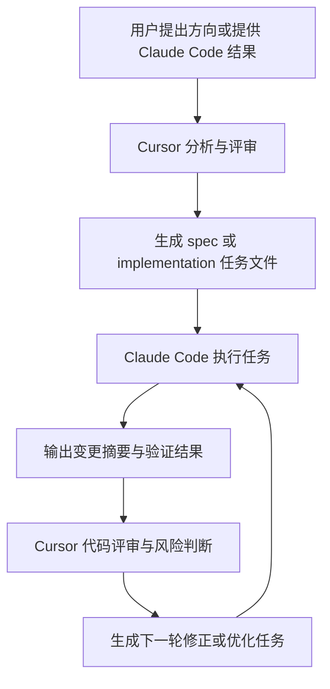

# TradeSnake Agent 协作设计

> 日期：2026-04-26  
> 适用对象：用户、Cursor 设计/评审代理、Claude Code 执行代理  
> 目标：建立一套可持续的分析、规划、评审、优化与执行分工，让 Claude Code 能按任务文件连续推进，减少不必要的人工决策中断。

---

## 一、协作目标

TradeSnake 已经形成了后端、前端、数据、回测和推荐等多个模块，也积累了 `docs/plans` 与 `docs/superpowers` 两套文档。后续协作的核心不是让执行代理临场猜测，而是把决策前置到设计和任务文件中：

- Cursor 代理负责项目分析、方案设计、任务拆解、代码评审和优化建议。
- Claude Code 负责根据明确任务文件做代码、文档、测试和验证执行。
- 用户负责确认产品方向、关键边界、外部资源与高风险取舍。

协作体系的成功标准：

- Claude Code 拿到一个任务文件后，可以在常规工程取舍上自主推进。
- 每个任务都有明确的输入、允许修改范围、验证方式和交付格式。
- 执行结果能被 Cursor 代理继续评审，并自然生成下一轮任务。
- 项目事实源逐步收敛，减少 README、架构文档、代码和 CI 之间的冲突。

---

## 二、角色边界

### 2.1 用户

用户只需要在这些场景做决策：

- 产品范围变化，例如是否从沪深主板扩展到创业板、科创板或北交所。
- 数据口径变化，例如战力公式、交易费用、回测区间、数据源优先级。
- 风险较高的工程变化，例如数据库迁移、删除历史兼容、修改公开 API、引入新服务。
- 涉及凭据、付费 API、外部账号、部署环境和机器资源的选择。
- Cursor 代理给出的设计方案需要选择方向时。

用户不需要为这些场景反复决策：

- 文件命名、局部函数拆分、测试文件位置等常规工程细节。
- 代码风格与局部实现策略，只要能沿用现有模式并通过验证。
- 明显过时文档与代码冲突时的修正文案。
- 小范围依赖补齐，只要是已被代码直接使用且不会改变架构边界。

### 2.2 Cursor 设计/评审代理

Cursor 代理负责：

- 阅读代码、文档、测试和 CI，整理项目事实基线。
- 输出设计文档、实施计划、评审意见和优化任务。
- 设计 Claude Code 可连续执行的提示词与任务文件。
- 在 Claude Code 完成后进行代码评审，优先指出 bug、回归风险和测试缺口。
- 把评审结论转化为下一轮可执行任务，而不是只给抽象建议。

Cursor 代理不负责：

- 在没有用户要求时替 Claude Code 执行大规模业务实现。
- 擅自改变产品策略或数据口径。
- 因为发现无关问题而扩大当前任务范围。

### 2.3 Claude Code 执行代理

Claude Code 负责：

- 严格按 `docs/superpowers/plans` 中的任务文件执行。
- 在任务范围内自主完成代码、测试、文档和验证。
- 遇到代码和文档冲突时，先按任务文件的事实源规则处理，并在结果中记录。
- 结束时输出变更摘要、验证结果、剩余风险和下一步建议。

Claude Code 不应做：

- 未经任务授权的大规模重构。
- 未经用户确认的产品范围、数据口径、外部服务或持久化结构变更。
- 删除或覆盖已有用户改动。
- 跳过验证后声称任务完成。

---

## 三、自主决策规则

### 3.1 默认允许 Claude Code 自主推进

以下情况默认允许 Claude Code 自主决策并继续执行：

- 选择与当前模块一致的实现风格、命名和目录结构。
- 增加聚焦的单元测试、集成测试或构建验证。
- 修正明显过时的文档描述，使其与代码和最新设计文档一致。
- 补齐任务范围内必需的错误处理、类型声明、导入路径或测试夹具。
- 修改任务直接涉及的文件，并保留其他未相关改动。
- 在验证失败时做不改变任务边界的修复，并重新验证。

### 3.2 必须停下询问用户

以下情况 Claude Code 必须停止执行并向用户说明选项：

- 需要修改股票池产品边界、战力公式、交易费用、回测基准或数据源优先级。
- 需要引入新数据库、新队列、新云服务、新付费 API 或新凭据。
- 需要删除数据、迁移持久化格式、修改线上兼容 API 或破坏已有用户工作流。
- 任务文件给出的目标、范围或验证方式互相矛盾，且无法用最小合理解释解决。
- 基线测试大面积失败，无法判断是既有问题还是本次变更引入。
- 需要执行破坏性 git 命令、强推、重置或覆盖用户未提交改动。

### 3.3 可以向 Cursor 代理升级的问题

以下情况适合让 Cursor 代理重新设计或评审：

- 发现文档事实源与代码差异较大，需要重新定义“当前真相”。
- 实现过程中发现原任务拆解过粗，难以在一个安全变更内完成。
- 代码评审发现风险比预期高，需要先补设计再继续。
- 验证命令缺失或互相冲突，需要制定新的验证矩阵。

---

## 四、任务文件协议

所有给 Claude Code 执行的任务文件默认放在：

- 设计：`docs/superpowers/specs/YYYY-MM-DD-<topic>-design.md`
- 执行：`docs/superpowers/plans/YYYY-MM-DD-<topic>-implementation.md`
- 小任务模板：`docs/superpowers/plans/CLAUDE_CODE_TASK_TEMPLATE.md`
- 项目事实：`docs/superpowers/plans/PROJECT_FACT_BASE.md`

每个执行任务必须包含：

- Goal：本次任务的可验证目标。
- Context：相关事实源、已知冲突和不可扩大范围。
- Autonomy：Claude Code 可以自主处理的事项。
- Stop Conditions：必须停下询问的条件。
- Files：允许创建或修改的文件。
- Steps：可勾选的执行步骤。
- Verification：必须运行或说明无法运行的验证命令。
- Report：完成后的汇报格式。

任务文件应避免：

- 只写“优化”“修复”“完善”而没有验收标准。
- 把多个高风险模块混在一个任务里。
- 让 Claude Code 自己决定产品策略。
- 要求“全部修好”但不给优先级。

---

## 五、事实源规则

当代码、README、架构文档、历史任务和测试不一致时，默认优先级为：

1. 当前代码与可运行测试。
2. 最新日期的 `docs/superpowers/specs` 与 `docs/superpowers/plans`。
3. `docs/plans/PROJECT_OVERVIEW.md` 和模块架构文档。
4. 根目录 `README.md`。
5. `docs/references` 和旧评审文档。

例外情况：

- 产品范围、交易费用、战力公式等业务口径，若用户明确指定，以用户最新指令为准。
- 如果代码明显有 bug，不能仅因“代码是现状”就把 bug 当事实源。
- 如果 CI 与本地运行命令冲突，任务结果必须同时记录冲突和实际验证结果。

---

## 六、验证策略

Claude Code 不应只靠阅读判断完成。每个任务都必须尽量运行验证：

- 后端局部任务：优先运行对应 `python -m pytest ... -v`。
- 后端公共行为：至少运行 `python -m pytest backend/tests/ -v`，必要时追加 `tests/backtester`。
- 前端任务：优先运行 `npm run build`；若补齐 lint/test 脚本，再运行对应命令。
- 文档任务：运行文本检查命令，至少确认新增文件存在、无未完成标记、无误留占位内容、无明显路径错误。
- 无法运行验证时：说明原因、缺失依赖和建议的后续验证命令。

---

## 七、持续循环

推荐工作流如下：

这个循环的重点是把“让 Claude Code 工作”变成可复用的工程流程，而不是每次重新解释项目背景。

---

## 八、首批落地顺序

第一批不直接改业务逻辑，先建立协作基础：

1. 写入 Claude Code 通用任务模板。
2. 整理项目事实基线。
3. 写入首个执行任务文件，让 Claude Code 核对和完善协作体系。
4. 后续再按优先级拆分：运行方式/CI 对齐、测试范围统一、前端工程化、README 与架构文档同步。

---

## 九、设计自查

- 没有授权 Claude Code 自主改变产品范围、数据口径或持久化结构。
- 允许 Claude Code 在常规工程细节上继续推进，满足“不要动不动让我做决策”的要求。
- 所有任务都有验证与汇报要求，便于后续评审。
- 文档位置沿用现有 `docs/superpowers` 体系，不另起孤立目录。
